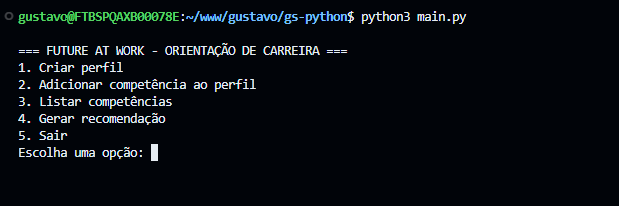
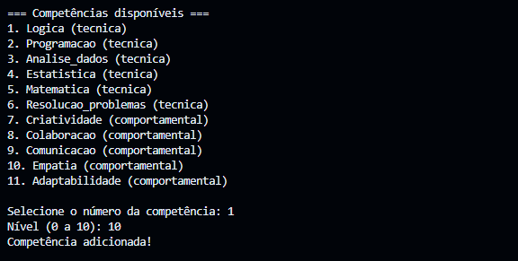
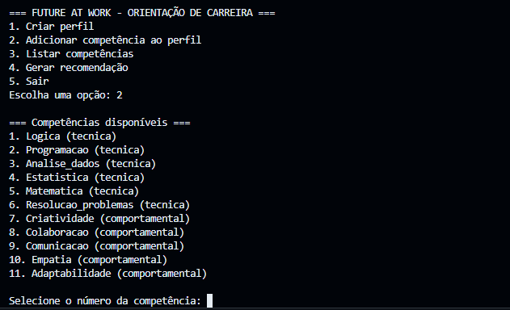
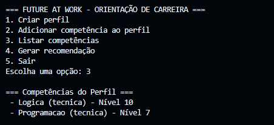
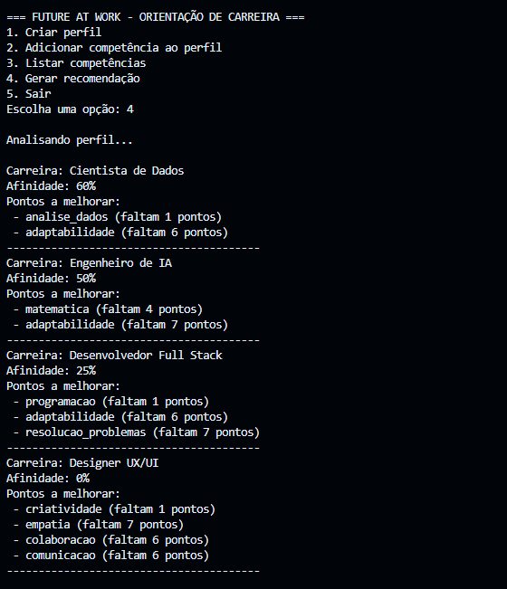

# Future at Work – Orientação de Carreira

Aplicação de linha de comando simples que ajuda usuários a registrarem suas competências, analisarem afinidade com diferentes carreiras e receberem recomendações de pontos a desenvolver. O objetivo é servir como exercício didático, mantendo código direto e organizado em módulos claros.

## Execução

1. Garanta que tenha Python 3 instalado (qualquer versão recente).
2. No diretório do projeto, execute:
   ```bash
   python3 main.py
   ```
3. Use o menu interativo para criar o perfil, adicionar competências, listar informações ou gerar recomendações.

## Estrutura do Projeto

```
.
├── main.py
├── app/
│   └── cli.py            # CLI interação com usuário
├── domain/
│   ├── competencia.py    # Classe Competencia
│   ├── perfil.py         # Classe Perfil
│   └── carreira.py       # Classe Carreira
├── data/
│   ├── competencias.py   # Competencias disponiveis
│   └── carreiras.py      # Carreiras com seus respectivos requisitos
└── services/
    └── recomendador.py   # Avaliação e recomendação
```

### Classes Principais

- **Competencia (`domain/competencia.py`)**: representa uma habilidade com nome, tipo e nível.
- **Perfil (`domain/perfil.py`)**: agrupa competências associadas a um usuário e fornece utilitários de consulta.
- **Carreira (`domain/carreira.py`)**: define requisitos (competência + mínimo) necessários por carreira.
- **Recomendador (`services/recomendador.py`)**: avalia o perfil contra as carreiras e gera a lista ordenada por afinidade.

### Fluxo Básico

`main.py` chama `app/cli.py`, que:

1. Apresenta o menu principal.
2. Permite criar um perfil e adicionar competências que vêm de `data/competencias.py`.
3. Usa `data/carreiras.py` + `services/recomendador.py` para calcular recomendações.

### Como funciona o recomendador

1. Para cada carreira, percorre os requisitos definidos (ex.: lógica ≥ 7, programação ≥ 8).
2. Em cada requisito, procura a competência correspondente no perfil:
   - Se existir, soma o nível e verifica se atende ao mínimo. Requisitos atendidos incrementam a pontuação.
   - Se não existir ou estiver abaixo do necessário, registra quanto falta para atingir o mínimo.
3. Calcula um score simples (`requisitos_atendidos / total_de_requisitos`) para cada carreira.
4. Ordena as carreiras pelo score (da maior afinidade para a menor) e devolve, junto com os pontos faltantes para cada uma.

## Demonstração Visual

Etapas principais da interface de linha de comando:

1. **Menu principal** <br>
   
2. **Criação de perfil** <br>
   
3. **Adição de competências** <br>
   
4. **Listagem de competências disponíveis** <br>
   
5. **Competências cadastradas pelo usuário** <br>
   
6. **Geração de recomendação** <br>
   
7. **Saída do sistema** <br>
   
